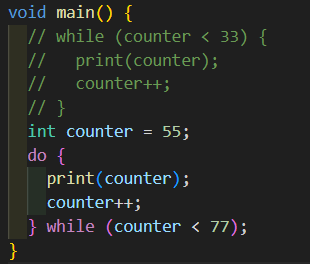
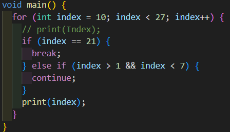

# Annisa-Kurniawati/04/2341720070
# Praktikum 1: Menerapkan Control Flows ("if/else")
# Langkah 1
codelab03_dart/img/image-1.png
# Langkah 2
# Jelaskan:
# Jika di run code awal error dikarenakan penulisan sintaks yang harusnya huruf kecil pada code tersebut masih huruf besar. 
# Langkah 3
# Jika ditambahkan code tersebut dan di run masih error. cara untuk memperbaiki adalah dengan meng command code pada langkah 1 daan memperbaiki penulisan sintaks pada code di langkah 3
# Output:

# Praktikum 2: Menerapkan Perulangan "while" dan "do-while"
# Langkah 1

# Langkah 2
# Jelaskan: 
# Jika di run code tersebut error karena variabel counter tidak diinisialisasi.
# Langkah 3
# Jika dijalankan error, maka di perbaiki dengan meng command code pada langkah 1 dan menambahkan inisialisasi pada code di langkah 3
# Output:

# Praktikum 3: Menerapkan Perulangan "for" dan "break-continue"
# Langkah 1

# Langkah 2:
# Jelaskan:
# Jika di run error karena kesalahan sintaks for untuk loop, index bukan pernyataan valid. jadi seharusnya index++. variabel indeks tidak di deklarasikan dengan tipe data, tidak sesuainya penulisan di sintaks index, dan fungsi print tidak dikenali.
# Langkah 3
# Jika dijalankan error, maka di perbaiki dengan memperbaiki penulisan sintaksnya.
# Output:

# Tugas Praktikum
# 1. Praktikum 1 samapi 3
# Sudah dijelaskan di atas
# 2. Buatlah sebuah program yang dapat menampilkan bilangan prima dari angka 0 sampai 201 menggunakan Dart. Ketika bilangan prima ditemukan, maka tampilkan nama lengkap dan NIM Anda.

